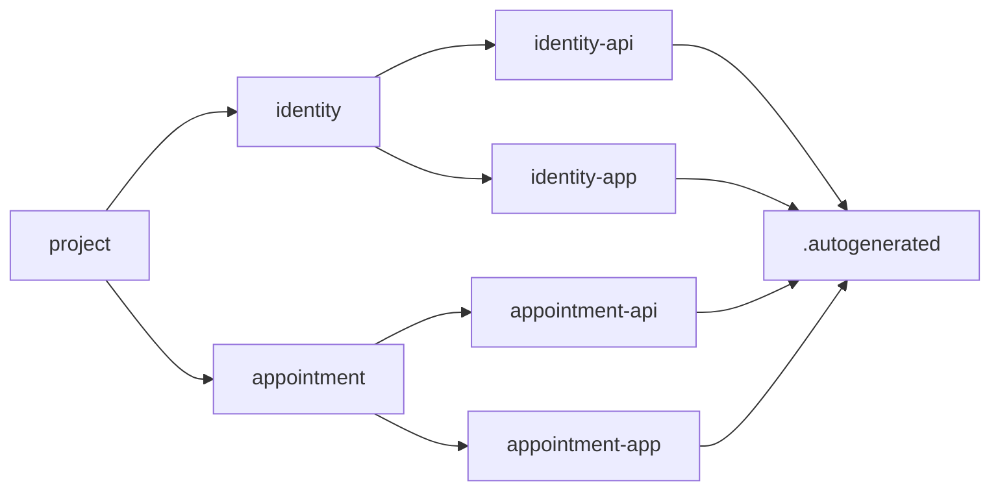

# TDK Example

A Project–Stack–Resource landscape you can clone and run. Two stacks. Four resources. One manifest per resource.

[Clone](#run) · [Stacks](#stacks) · [Generation](#generation) · [CLI](https://github.com/tdk-landscape/tdk-cli)

[](https://github.com/tdk-landscape/tdk-cli)
[](https://tilt.dev)
[](https://bun.sh)

---

## Run

```bash
git clone https://github.com/tdk-landscape/tdk-example.git
cd tdk-example
bun install
tdk up
```

Bring up one stack with `tdk up identity`. Tear everything down with `tdk down`.

---

## Stacks

| | identity | appointment |
| --- | --- | --- |
| API | [`identity-api`](services/identity/identity-api) · `:4000` · Hono | [`appointment-api`](services/appointment/appointment-api) · `:4001` · Hono |
| UI | [`identity-app`](services/identity/identity-app) · `:3000` · Vite | [`appointment-app`](services/appointment/appointment-app) · `:3001` · Vite |
| Up | `tdk up identity` | `tdk up appointment` |

Live surfaces after `tdk up`:

| Resource | Origin | Probe |
| --- | --- | --- |
| identity-api | http://localhost:4000 | `/health` |
| identity-app | http://localhost:3000 | — |
| appointment-api | http://localhost:4001 | `/health` |
| appointment-app | http://localhost:3001 | — |

---

## Generation

`service.json` is the source of truth. Tilt writes Docker, Vite, env, and TypeScript config into each resource’s `.autogenerated/` directory. Edit the manifest. Never edit the output. The next `tdk up` will replace it.

```
tdk-example/
├── Tiltfile
├── TILT_SERVICE_DEFAULTS.star
├── TILT_TECH_STACK.star
└── services/
    ├── identity/
    │   ├── identity-api/
    │   │   ├── service.json
    │   │   ├── .autogenerated/
    │   │   └── src/
    │   └── identity-app/
    │       ├── service.json
    │       ├── .autogenerated/
    │       └── src/
    └── appointment/
        ├── appointment-api/
        └── appointment-app/
```

Tracked: the empty `.autogenerated/` folder (via `.gitkeep`). Ignored: every file Tilt regenerates inside it.



---

## Extend

This repository is already a TDK project. The same commands create more surface area:

```bash
tdk resource my-api --type backend --stack identity
tdk resource my-app --type frontend --stack identity
tdk stack identity
tdk up identity
tdk status
```

```bash
bun test
cd services/identity/identity-api && bun test
```

---

## License

MIT. [TDK Landscape](https://github.com/tdk-landscape) · [tdk-cli](https://github.com/tdk-landscape/tdk-cli) · [Tilt](https://docs.tilt.dev) · [Hono](https://hono.dev) · [Vite](https://vitejs.dev)
