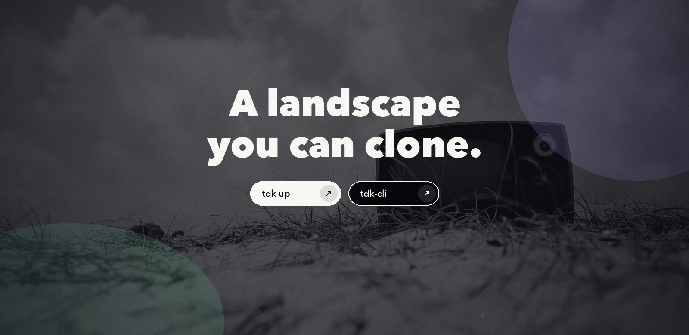
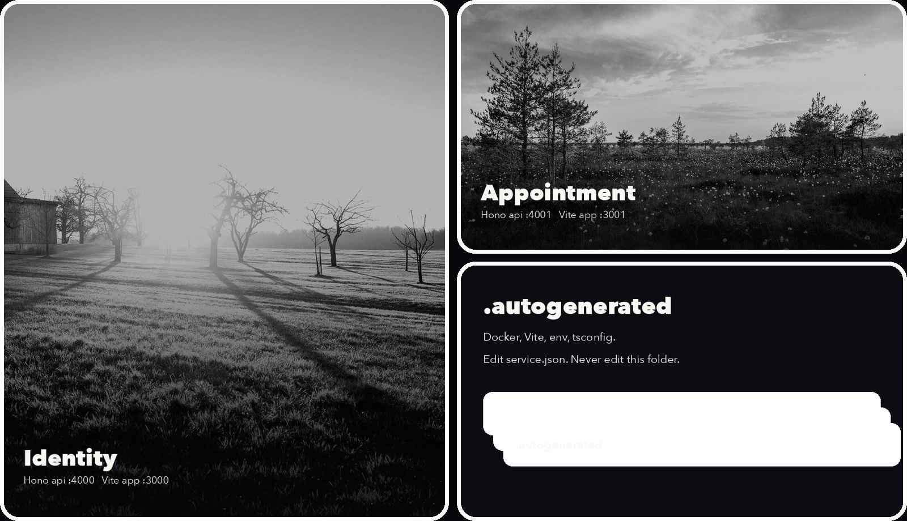
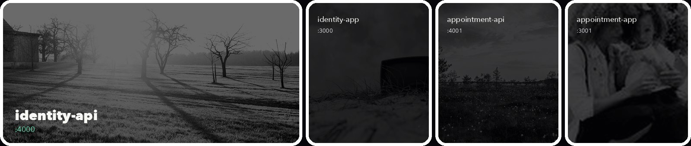

<p align="center">
  
</p>

<p align="center">
  <a href="#run-it">Run it</a>
  &nbsp;&nbsp;/&nbsp;&nbsp;
  <a href="#the-landscape">Explore the landscape</a>
  &nbsp;&nbsp;/&nbsp;&nbsp;
  <a href="#generation">Understand generation</a>
  &nbsp;&nbsp;/&nbsp;&nbsp;
  <a href="#extend-it">Extend it</a>
  &nbsp;&nbsp;/&nbsp;&nbsp;
  <a href="https://github.com/tdk-landscape/tdk-cli">TDK CLI</a>
</p>

<br>

## A complete TDK landscape, ready to run

This repository is the smallest useful demonstration of the TDK **Project-Stack-Resource** model: one project, two independently runnable stacks, and four resources described by one `service.json` each.

You declare the service. TDK discovers the landscape, resolves dependencies, allocates the configured ports, and generates the local Docker, Vite, environment, and TypeScript plumbing inside `.autogenerated/`.

<p align="center">
  
</p>

## Run It

### Prerequisites

- [Docker](https://docs.docker.com/get-docker/) is running.
- [Tilt](https://docs.tilt.dev/install.html) is installed.
- [Bun](https://bun.sh/docs/installation) is installed.
- [TDK CLI](https://github.com/tdk-landscape/tdk-cli#installation) is available as `tdk`.

```bash
git clone https://github.com/tdk-landscape/tdk-example.git
cd tdk-example
tdk up
```

TDK starts both stacks from their resource manifests. There is no root package to install; each resource owns its own package and generated development workflow.

```bash
# Start one stack only
tdk up identity

# Inspect the running landscape
tdk status

# Stop everything
tdk down
```

## The Landscape

<p align="center">
  
</p>

| Stack | Resource | Runtime | Port | Depends on |
|---|---|---|---:|---|
| **identity** | [`identity-api`](services/identity/identity-api) | Hono API | [`4000`](http://localhost:4000/health) | None |
| **identity** | [`identity-app`](services/identity/identity-app) | Vite app | `3000` | `identity-api` |
| **appointment** | [`appointment-api`](services/appointment/appointment-api) | Hono API | [`4001`](http://localhost:4001/health) | None |
| **appointment** | [`appointment-app`](services/appointment/appointment-app) | Vite app | `3001` | `appointment-api` |

<p align="center">
  
</p>

The hierarchy stays deliberately small:

```text
tdk-example/
├── Tiltfile
├── TILT_SERVICE_DEFAULTS.star
├── TILT_TECH_STACK.star
└── services/
    ├── identity/
    │   ├── identity-api/
    │   │   ├── service.json
    │   │   ├── .autogenerated/
    │   │   └── src/
    │   └── identity-app/
    │       ├── service.json
    │       ├── .autogenerated/
    │       └── src/
    └── appointment/
        ├── appointment-api/
        └── appointment-app/
```

## Generation

<p align="center">
  
</p>

Every resource owns a compact [`service.json`](services/identity/identity-api/service.json). It describes identity, type, stack, port, dependencies, and health behavior:

```json
{
  "appName": "identity-api",
  "domain": "identity",
  "type": "backend",
  "stack": "identity",
  "port": 4000,
  "dependencies": [],
  "healthCheck": {
    "enabled": true,
    "path": "/health"
  }
}
```

Running `tdk up` turns that manifest into the files needed by Tilt and the selected technology stack.

> [!IMPORTANT]
> Edit `service.json`, `TILT_SERVICE_DEFAULTS.star`, or `TILT_TECH_STACK.star`. Never edit `.autogenerated/`; the next generation pass replaces its contents.

The empty `.autogenerated/` directories remain in Git through `.gitkeep`. Their generated contents stay ignored.

## Project, Stack, Resource

| Level | Meaning in this repository | Command surface |
|---|---|---|
| **Project** | The cloneable landscape rooted at this repository | `tdk up`, `tdk down`, `tdk status` |
| **Stack** | A deployable group such as `identity` or `appointment` | `tdk up identity` |
| **Resource** | One runnable API, app, worker, or infrastructure unit | `tdk resource <name> ...` |

Dependencies are explicit. For example, `identity-app` declares `identity-api`, allowing TDK to preserve startup intent without hard-coding service orchestration in application code.

## Extend It

Add resources through the CLI, assign them to a stack, and let TDK regenerate the landscape:

```bash
tdk resource my-api --type backend --stack identity
tdk resource my-app --type frontend --stack identity
tdk stack identity
tdk up identity
tdk status
```

Each resource is independently testable:

```bash
cd services/identity/identity-api
bun install
bun test
bun run typecheck
```

Use the same pattern for the other three resources.

## What To Inspect Next

- [`Tiltfile`](Tiltfile) shows how the TDK extension discovers service manifests.
- [`TILT_SERVICE_DEFAULTS.star`](TILT_SERVICE_DEFAULTS.star) centralizes ports, health checks, memory limits, images, and network defaults.
- [`TILT_TECH_STACK.star`](TILT_TECH_STACK.star) defines the generated behavior for each supported runtime.
- [`services/`](services) contains the smallest working backend and frontend examples.
- [TDK CLI](https://github.com/tdk-landscape/tdk-cli) documents installation, generation commands, and the full PSR workflow.

---

<p align="center">
  <strong>Clone the landscape. Change the manifests. Let TDK carry the repetition.</strong>
</p>

<p align="center">
  <a href="https://github.com/tdk-landscape">TDK Landscape</a>
  &nbsp;&nbsp;/&nbsp;&nbsp;
  <a href="https://github.com/tdk-landscape/tdk-cli">CLI</a>
  &nbsp;&nbsp;/&nbsp;&nbsp;
  <a href="https://docs.tilt.dev">Tilt</a>
  &nbsp;&nbsp;/&nbsp;&nbsp;
  <a href="https://hono.dev">Hono</a>
  &nbsp;&nbsp;/&nbsp;&nbsp;
  <a href="https://vite.dev">Vite</a>
  &nbsp;&nbsp;/&nbsp;&nbsp;
  MIT
</p>
