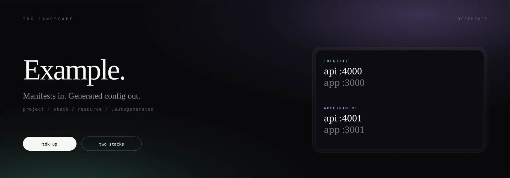
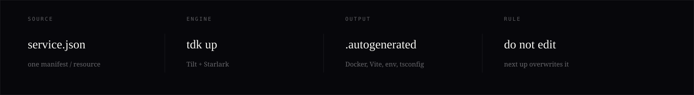
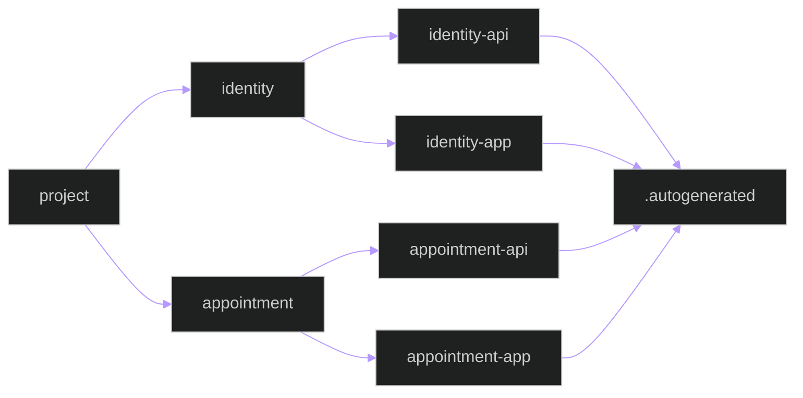

<p align="left">
  
</p>

<sub>
  <a href="https://github.com/tdk-landscape/tdk-cli">tdk-cli</a>
  &nbsp;·&nbsp;
  <a href="#run">run</a>
  &nbsp;·&nbsp;
  <a href="#stacks">stacks</a>
  &nbsp;·&nbsp;
  <a href="#generation">generation</a>
  &nbsp;·&nbsp;
  <a href="https://github.com/tdk-landscape">tdk-landscape</a>
</sub>

<br><br>

A cloneable Project–Stack–Resource landscape. Two stacks, four resources, one `service.json` each. Tilt fills `.autogenerated/` so you never hand-write Docker, Vite, or env files.

---

## Run

```bash
git clone https://github.com/tdk-landscape/tdk-example.git
cd tdk-example
bun install
tdk up
```

Single stack: `tdk up identity`. All quiet: `tdk down`.

---

## Stacks

<table>
  <tr>
    <td width="50%" valign="top">
      <sub>IDENTITY</sub>
      <br><br>
      <a href="services/identity/identity-api"><strong>identity-api</strong></a>
      <br>
      Hono · <code>:4000</code> · <a href="http://localhost:4000/health">/health</a>
      <br><br>
      <a href="services/identity/identity-app"><strong>identity-app</strong></a>
      <br>
      Vite · <code>:3000</code>
      <br><br>
      <code>tdk up identity</code>
    </td>
    <td width="50%" valign="top">
      <sub>APPOINTMENT</sub>
      <br><br>
      <a href="services/appointment/appointment-api"><strong>appointment-api</strong></a>
      <br>
      Hono · <code>:4001</code> · <a href="http://localhost:4001/health">/health</a>
      <br><br>
      <a href="services/appointment/appointment-app"><strong>appointment-app</strong></a>
      <br>
      Vite · <code>:3001</code>
      <br><br>
      <code>tdk up appointment</code>
    </td>
  </tr>
</table>

---

## Generation

<p align="left">
  
</p>

Each resource keeps an empty `.autogenerated/` directory in git (`.gitkeep`). Everything Tilt writes into that folder stays ignored.

```
tdk-example/
├── Tiltfile
├── TILT_SERVICE_DEFAULTS.star
├── TILT_TECH_STACK.star
└── services/
    ├── identity/
    │   ├── identity-api/     service.json  .autogenerated/  src/
    │   └── identity-app/     service.json  .autogenerated/  src/
    └── appointment/
        ├── appointment-api/
        └── appointment-app/
```



---

## Extend

Already a TDK project. Add surface, then bring it up.

```bash
tdk resource my-api --type backend --stack identity
tdk resource my-app --type frontend --stack identity
tdk stack identity
tdk up identity
tdk status
```

```bash
bun test
cd services/identity/identity-api && bun test
```

---

<sub>MIT · <a href="https://github.com/tdk-landscape">TDK Landscape</a> · <a href="https://github.com/tdk-landscape/tdk-cli">CLI</a> · <a href="https://docs.tilt.dev">Tilt</a> · <a href="https://hono.dev">Hono</a> · <a href="https://vitejs.dev">Vite</a></sub>
